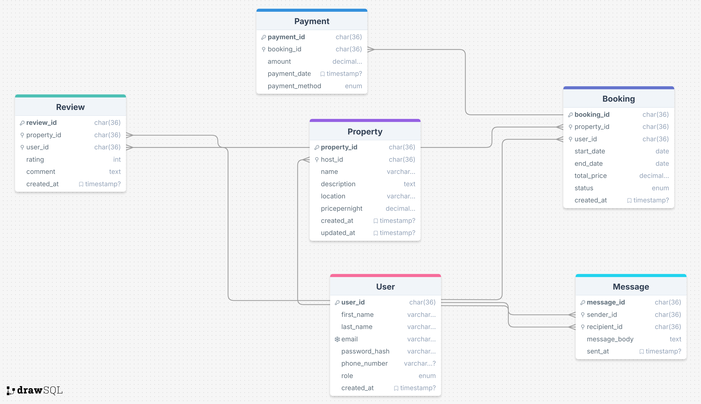

## Database Design
### Entity Structure

### Entity Relationship Diagram

### 
The diagram above illustrates the relationships between key entities in our database system, showing the interconnections between Users, Properties, Bookings, Payments, Reviews, and Messages.
#### Users
- **user_id**: Primary Key, UUID, Indexed
- **first_name**: VARCHAR, NOT NULL
- **last_name**: VARCHAR, NOT NULL
- **email**: VARCHAR, UNIQUE, NOT NULL
- **password_hash**: VARCHAR, NOT NULL
- **phone_number**: VARCHAR, NULL
- **role**: ENUM (guest, host, admin), NOT NULL
- **created_at**: TIMESTAMP, DEFAULT CURRENT_TIMESTAMP

#### Properties
- **property_id**: Primary Key, UUID, Indexed
- **host_id**: Foreign Key, references User(user_id)
- **name**: VARCHAR, NOT NULL
- **description**: TEXT, NOT NULL
- **location**: VARCHAR, NOT NULL
- **price_per_night**: DECIMAL, NOT NULL
- **created_at**: TIMESTAMP, DEFAULT CURRENT_TIMESTAMP
- **updated_at**: TIMESTAMP, ON UPDATE CURRENT_TIMESTAMP

#### Bookings
- **booking_id**: Primary Key, UUID, Indexed
- **property_id**: Foreign Key, references Property(property_id)
- **user_id**: Foreign Key, references User(user_id)
- **start_date**: DATE, NOT NULL
- **end_date**: DATE, NOT NULL
- **total_price**: DECIMAL, NOT NULL
- **status**: ENUM (pending, confirmed, canceled), NOT NULL
- **created_at**: TIMESTAMP, DEFAULT CURRENT_TIMESTAMP

#### Payments
- **payment_id**: Primary Key, UUID, Indexed
- **booking_id**: Foreign Key, references Booking(booking_id)
- **amount**: DECIMAL, NOT NULL
- **payment_date**: TIMESTAMP, DEFAULT CURRENT_TIMESTAMP
- **payment_method**: ENUM (credit_card, paypal, stripe), NOT NULL

#### Reviews
- **review_id**: Primary Key, UUID, Indexed
- **property_id**: Foreign Key, references Property(property_id)
- **user_id**: Foreign Key, references User(user_id)
- **rating**: INTEGER, CHECK: rating >= 1 AND rating <= 5, NOT NULL
- **comment**: TEXT, NOT NULL
- **created_at**: TIMESTAMP, DEFAULT CURRENT_TIMESTAMP

#### Messages
- **message_id**: Primary Key, UUID, Indexed
- **sender_id**: Foreign Key, references User(user_id)
- **recipient_id**: Foreign Key, references User(user_id)
- **message_body**: TEXT, NOT NULL
- **sent_at**: TIMESTAMP, DEFAULT CURRENT_TIMESTAMP

### Entity Relationships

- A User can be either a guest, host, or admin
- A User (as host) can have multiple Properties
- A User (as guest) can make multiple Bookings
- A Property can have multiple Bookings
- A Booking belongs to exactly one Property and one User (guest)
- A Payment belongs to exactly one Booking
- Reviews are linked to specific Properties and Users
- Messages can be sent between Users

### Constraints and Indexing

- Unique constraint on User email
- Rating values constrained between 1-5
- All primary keys are automatically indexed
- Additional indexes on frequently accessed fields
## Feature Breakdown
### User Management
User management provides secure authentication and profile systems allowing guests and hosts to create accounts, manage their profiles, and build reputation in the community. This feature forms the foundation of the platform's identity system, enabling personalized experiences and account-specific functionalities.

### Property Management
Property management enables hosts to create, update, and manage their property listings with detailed descriptions, photos, pricing, and availability calendars. This core feature gives property owners control over their listings while providing potential guests with comprehensive information needed to make informed booking decisions.

### Booking System
The booking system facilitates the reservation process from initial search to confirmation, handling date selection, pricing calculations, and booking status tracking. It serves as the primary transaction mechanism of the platform, coordinating the critical connection between guests seeking accommodations and hosts offering their properties.

### Review and Rating System
This feature allows guests to provide feedback and ratings after their stays, building trust in the community and helping future guests make informed decisions. The system also enables hosts to respond to reviews, creating transparent communication channels that enhance the platform's reliability.

### Search and Filtering
Advanced search functionality lets users find properties based on location, price range, amenities, dates, and other criteria for a tailored browsing experience. This discovery mechanism optimizes the user experience by efficiently connecting guests with relevant property listings that match their specific requirements.

### Payment Processing
Secure payment processing handles transactions between guests and hosts, including initial payments, refunds, and host payouts. This critical infrastructure ensures financial security while managing the monetary aspects of bookings with appropriate fee calculations and payment status tracking.

### Messaging System
An integrated messaging system enables direct communication between hosts and guests before, during, and after bookings for questions, coordination, and support. This feature facilitates clear communication channels that are essential for addressing specific needs and building trust between users.